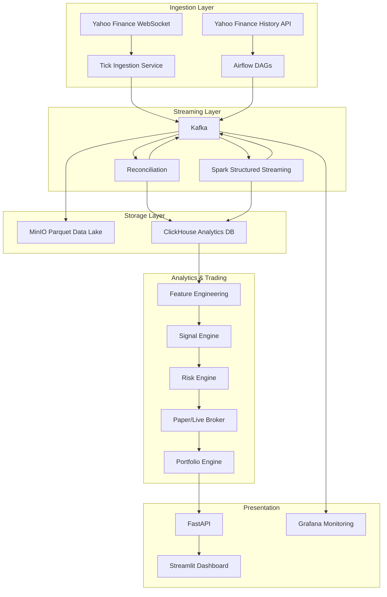

# System Architecture

## High-Level Data Flow



## Component Responsibilities

### Ingestion (`ingestion/`)

| Module | Responsibility |
|--------|----------------|
| `yahoo_client.py` | WebSocket connection, message normalization |
| `ticks.py` | Tick validation, Kafka publishing |
| `candles.py` | Historical candle fetch, incremental overlap |
| `kafka_utils.py` | Shared Kafka producer helpers |
| `config.py` | Bootstrap servers, topic names, symbol lists |

### Entrypoints (`entrypoint/`)

| Service | Type | Responsibility |
|---------|------|----------------|
| `tick_service.py` | Long-running | WebSocket → `market.ticks` |

### Orchestration (`airflow/dags/`)

Thin DAGs that call `ingestion/` functions. No business logic.

| DAG | Schedule | Calls |
|-----|----------|-------|
| `dag_candles_1m` | Every minute + 10s | `ingestion.candles.fetch_latest_candles(interval='1m')` |
| `dag_candles_5m` | Every 5 min + 10s | `ingestion.candles.fetch_latest_candles(interval='5m')` |
| `dag_reconciliation` | Every 5 min | `streaming.reconciliation.reconcile_candles()` |
| `dag_data_quality` | Hourly | `analysis.data_quality.run_checks()` |

### Streaming (`streaming/`)

| Module | Responsibility |
|--------|----------------|
| `stream_candle_builder.py` | Ticks → OHLCV candles (1m, 5m) |
| `reconciliation.py` | Compare calculated vs raw candles |
| `utils.py` | Spark session, Kafka read/write helpers |

### Storage (`storage/`)

| Module | Responsibility |
|--------|----------------|
| `minio_client.py` | S3-compatible Parquet writes |
| `clickhouse_client.py` | Analytical inserts and queries |
| `sinks.py` | Unified sink interface for ticks/candles |

### Analysis (`analysis/`)

| Module | Responsibility |
|--------|----------------|
| `features.py` | EMA, RSI, MACD, ATR, VWAP, returns |
| `data_quality.py` | Completeness, uniqueness, OHLC validity |

## Kafka Topics

| Topic | Producer | Consumer |
|-------|----------|----------|
| `market.ticks` | Tick service | Spark, MinIO sink |
| `market.candles.raw` | Airflow candle DAGs | Reconciliation, ClickHouse |
| `market.candles.calculated` | Spark streaming | Reconciliation, ClickHouse |
| `market.candles.reconciled` | Reconciliation | ClickHouse, MinIO, Features |
| `market.signals` | Signal engine | Risk engine, API |
| `market.errors` | All ingestion | Monitoring |

## MinIO Partition Layout

```
market-data/
  raw/ticks/symbol=AAPL/year=2026/month=08/day=12/*.parquet
  raw/candles/source=raw/symbol=AAPL/interval=1m/year=2026/month=08/day=12/*.parquet
  reconciled/candles/symbol=AAPL/interval=1m/year=2026/month=08/day=12/*.parquet
```

## ClickHouse Tables

- `market_ticks` — Raw tick events
- `market_candles` — Raw, calculated, and reconciled candles (source column distinguishes)
- `market_features` — Computed indicators
- `market_signals` — Strategy outputs
- `orders`, `trades`, `positions` — Trading state (future phases)

## Technology Stack

| Layer | Technology |
|-------|------------|
| Language | Python 3.12, uv |
| Orchestration | Airflow 3.2 |
| Event Bus | Kafka 7.6 (KRaft) |
| Stream Processing | Spark Structured Streaming |
| Data Lake | MinIO (Parquet) |
| Analytics DB | ClickHouse |
| Ingestion | yfinance |
| API | FastAPI (future) |
| Dashboard | Streamlit (future) |
| Monitoring | Prometheus + Grafana (future) |
