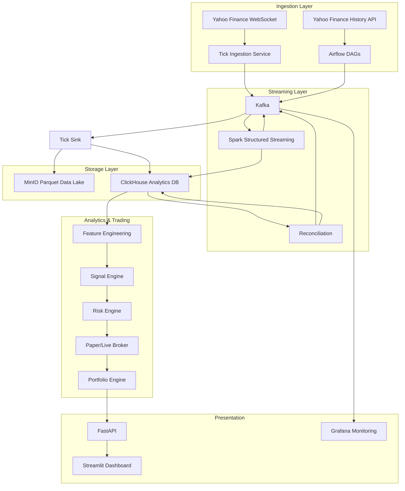

# System Architecture

## High-Level Data Flow



> `candle-sink` consumes both candle topics and feeds ClickHouse and MinIO; `Recon` reads both
> series from ClickHouse rather than from Kafka.

## Component Responsibilities

### Ingestion (`ingestion/`)

| Module | Responsibility |
|--------|----------------|
| `yahoo_client.py` | WebSocket connection, message normalization |
| `ticks.py` | Tick validation, Kafka publishing |
| `candles.py` | Historical candle fetch, incremental overlap |
| `kafka_utils.py` | Shared Kafka producer helpers |
| `config.py` | Bootstrap servers, topic names, symbol lists |

### Entrypoints (`entrypoint/`)

| Service | Type | Responsibility |
|---------|------|----------------|
| `tick_service.py` | Long-running | WebSocket → `market.ticks` |
| `tick_sink_service.py` | Long-running | `market.ticks` → MinIO Parquet + ClickHouse |

### Orchestration (`airflow/dags/`)

Thin DAGs that call `ingestion/` functions. No business logic.

| DAG | Schedule | Calls |
|-----|----------|-------|
| `market_candles_1m_dag` (`dag_candles.py`) | Every minute + 10s | `ingestion.candles.fetch_latest_candles(interval='1m')` |
| `market_candles_5m_dag` (`dag_candles.py`) | Every 5 min + 10s | `ingestion.candles.fetch_latest_candles(interval='5m')` |
| `market_candles_backfill_dag` (`dag_backfill.py`) | Manual trigger | `ingestion.candles.fetch_candles_range()` — chunked |
| `market_reconciliation_dag` | Every 5 min | `streaming.reconciliation.reconcile_candles()` — **broken, see below** |
| `market_data_quality_dag` | Hourly | `analysis.data_quality.run_checks()` → `analysis.features.generate_features()` |

### Streaming (`streaming/`)

| Module | Responsibility |
|--------|----------------|
| `stream_candle_builder.py` | Ticks → OHLCV candles (1m, 5m) |
| `reconciliation.py` | Compare calculated vs raw candles |
| `spark_utils.py` | Spark session, Kafka read/write helpers |

> Reconciliation reads both candle series out of ClickHouse over an explicit time window, with Kafka
> as pure transport ([ADR-009](DECISIONS.md#adr-009-clickhouse-is-the-source-of-truth-for-reconciliation)).
> It no longer consumes topic offsets.

### Storage (`storage/`)

| Module | Responsibility |
|--------|----------------|
| `minio_client.py` | S3-compatible Parquet writes |
| `clickhouse_client.py` | Analytical inserts and queries |
| `sinks.py` | Unified sink interface for ticks/candles |
| `tick_sink.py` | Long-running consumer: `market.ticks` → MinIO + ClickHouse, batched with backoff |

### Analysis (`analysis/`)

| Module | Responsibility |
|--------|----------------|
| `features.py` | EMA, RSI, MACD, ATR, VWAP, returns |
| `data_quality.py` | Completeness, uniqueness, OHLC validity |

## Kafka Topics

| Topic | Producer | Consumer |
|-------|----------|----------|
| `market.ticks` | Tick service | Spark, tick sink |
| `market.candles.raw` | Airflow candle DAGs | Reconciliation — **no storage consumer exists yet** |
| `market.candles.calculated` | Spark streaming | Reconciliation — **no storage consumer exists yet** |
| `market.candles.reconciled` | Reconciliation | ClickHouse, MinIO, features |
| `market.signals` | Signal engine | Risk engine, API |
| `market.errors` | All ingestion | **none — topic is written but never consumed** |

## MinIO Partition Layout

```
market-data/
  raw/ticks/symbol=AAPL/year=2026/month=08/day=12/*.parquet
  raw/candles/source=raw/symbol=AAPL/interval=1m/year=2026/month=08/day=12/*.parquet
  reconciled/candles/symbol=AAPL/interval=1m/year=2026/month=08/day=12/*.parquet
```

## ClickHouse Tables

All in database `market_platform` (`infra/clickhouse/init.sql`):

| Table | Contents | Written by |
|-------|----------|------------|
| `market_ticks` | Raw tick events | `tick-sink` service |
| `market_candles` | Raw, calculated, and reconciled candles (`source` distinguishes) | candle DAGs, Spark, reconciliation |
| `market_features` | Computed indicators | `analysis/features.py` |
| `market_signals` | Strategy outputs | *not yet — schema only* |
| `market_orders`, `market_trades` | Trading state | *not yet — DDL only* |
| `market_positions` | Current positions | *not yet — DDL only* |

`market_candles` is currently a plain `MergeTree`, so re-writing the same candle key duplicates rows.
It is being migrated to `ReplacingMergeTree(replaced_at)` ordered by
`(symbol, interval, timestamp, source)` so reconciliation can re-run over overlapping windows
([ADR-011](DECISIONS.md#adr-011-candle-storage-is-idempotent-by-key)).

## Technology Stack

| Layer | Technology |
|-------|------------|
| Language | Python 3.12, uv |
| Orchestration | Airflow 3.2 |
| Event Bus | Kafka 7.6 (KRaft) |
| Stream Processing | Spark Structured Streaming |
| Data Lake | MinIO (Parquet) |
| Analytics DB | ClickHouse |
| Ingestion | yfinance |
| API | FastAPI (future) |
| Dashboard | Streamlit (future) |
| Monitoring | Prometheus + Grafana (future) |
