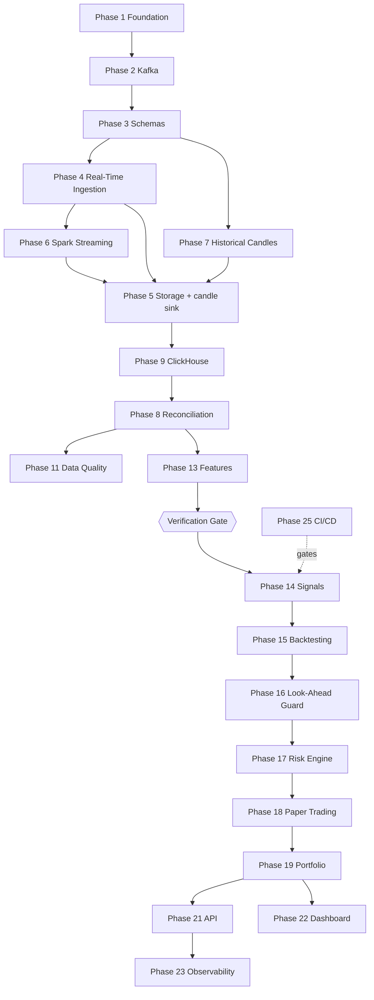

# Development Roadmap

26 phases organized into 6 milestones. Status as of October 2026.

Statuses are **binary**: `Complete` or `Not started`. Earlier revisions used approximate
percentages ("In Progress ~70%"), which described effort rather than behavior and could not be
checked against the code. A phase is complete when it demonstrably works — not when most of it has
been written.

See [CURRENT_STATE.md](CURRENT_STATE.md) for what is broken in the code that exists today, and
[DECISIONS.md](DECISIONS.md) for the architectural decisions each phase implements.

---

## Verification Gate

> **No trading phase (14 and beyond) begins until the data platform is verified.**
> Specifically, until `verify_pipeline` exits 0 and reconciled coverage sits near 1.0 for a completed
> window ([ADR-010](DECISIONS.md#adr-010-verification-gates-the-trading-stages)).

**Full implementation plan, in execution order, with per-step verification:**
[docs/superpowers/plans/2026-10-02-candle-persistence-and-verification.md](docs/superpowers/plans/2026-10-02-candle-persistence-and-verification.md)

Milestone D is the gate. A backtest run against unreconciled candles produces results that cannot be
believed, which costs far more time than closing the gap first. This gate exists because the platform
previously reached this point with reconciliation silently non-functional and no artifact capable of
detecting it.

---

## Milestone A — Foundation & Event Bus (Phases 1–3)

### Phase 1 — Project Foundation
**Status:** Complete

- [x] Git repository, `pyproject.toml`, `uv.lock`
- [x] Docker Compose (Kafka, Airflow, Postgres)
- [x] Ruff linting configuration
- [x] Pytest configuration and `tests/` directory
- [x] Repository structure (`context/`, `docs/`, `infra/`)
- [x] README with architecture and quick start

**Acceptance:** Cloneable repo with documented setup instructions.

---

### Phase 2 — Kafka Infrastructure
**Status:** Complete

- [x] Kafka broker in Docker (KRaft)
- [x] Persistent volumes for Kafka data
- [x] Topic init script (`infra/kafka/init-topics.sh`)
- [x] Standard topic definitions
- [x] Broker tuned to a bounded heap; heavyweight enterprise daemons removed

**Topics:**
| Topic | Partitions | Retention |
|-------|------------|-----------|
| `market.ticks` | 3 | 7 days |
| `market.candles.raw` | 3 | 30 days |
| `market.candles.calculated` | 3 | 30 days |
| `market.candles.reconciled` | 3 | 90 days |
| `market.signals` | 1 | 30 days |
| `market.errors` | 1 | 7 days |

**Deferred:** producer/consumer integration test — folded into the broader integration-testing work
that is itself deferred until after the verification gate.

---

### Phase 3 — Market Data Contracts
**Status:** Complete

- [x] JSON Schema for MarketTick, MarketCandle
- [x] JSON Schema for MarketSignal, Order, Trade, Position
- [x] Schema validation in ingestion producers ([ADR-004](DECISIONS.md#adr-004-json-schema-for-data-contracts))
- [x] Schema validation tests

**Note:** the signal, order, trade, and position schemas are defined and tested but have no producer.
They are contracts for future phases, not working components.

---

## Milestone B — Ingestion Layer (Phases 4, 7, 10)

### Phase 4 — Real-Time Yahoo Ingestion
**Status:** Complete (minor debt)

- [x] Yahoo WebSocket client (`ingestion/yahoo_client.py`)
- [x] Message normalization to MarketTick schema
- [x] Standalone tick service (`entrypoint/tick_service.py`) — [ADR-003](DECISIONS.md#adr-003-standalone-tick-service-not-airflow-task)
- [x] Kafka producer with error-topic routing
- [x] Configurable symbols via environment
- [x] Reconnect loop
- [x] Graceful shutdown on SIGTERM

**Outstanding:** reconnect uses a fixed 5s sleep; the roadmap and `storage/tick_sink.py` call for
exponential backoff. Low impact, worth aligning for consistency.

---

### Phase 7 — Historical Candle Ingestion
**Status:** Complete

- [x] Incremental fetch with overlap window
- [x] Publish to `market.candles.raw`
- [x] Configurable symbols
- [x] Airflow DAGs with post-close schedule (1m: every minute +10s; 5m: every 5min +10s)
- [x] Airflow Variables for symbol list (`MARKET_SYMBOLS`, resolved via `dag_common.py`)

**Acceptance:** DAGs fetch only the latest candles plus overlap; no full re-download. ✅

---

### Phase 10 — Airflow Orchestration
**Status:** Complete

- [x] Thin candle DAGs calling `ingestion/candles.py`
- [x] Reconciliation DAG
- [x] Data quality DAG
- [x] Tick service removed from Airflow (standalone)
- [x] Historical backfill DAG (`dag_backfill.py`, chunked range fetch)
- [x] Feature generation DAG inside `dag_data_quality.py`

**Acceptance:** No business logic in DAG files; all logic in importable modules
([ADR-005](DECISIONS.md#adr-005-thin-airflow-dags)). ✅ — the DAGs are genuinely thin.

---

## Milestone C — Storage & Streaming (Phases 5, 6, 9)

### Phase 5 — Raw Market Data Storage
**Status:** Complete

- [x] MinIO in Docker Compose
- [x] Parquet writer in `storage/minio_client.py`
- [x] Partition layout: `symbol/year/month/day`
- [x] Continuous **tick** sink from Kafka to MinIO (`tick-sink` compose service)
- [x] Continuous **candle** sink for `market.candles.raw` and `market.candles.calculated`
      (`candle-sink` compose service, `storage/candle_sink.py`)
- [x] Raw and calculated candles persisted to ClickHouse **and** MinIO with `source` distinguished,
      and routed to distinct prefixes (`raw/` vs `calculated/`) so Spark candles never sit under a
      path that reads as Yahoo data
- [x] Candle sink validates against `market_candle.schema.json` before writing — the Spark path
      publishes without validating, so this is the last checkpoint before storage. Failures go to
      `market.errors` ([ADR-004](DECISIONS.md#adr-004-json-schema-for-data-contracts))
- [x] Shared sink loop extracted to `storage/kafka_sink.py`, so both sinks have one tested
      implementation of broker retry, signal handling, and batching

**Note:** `market.candles.raw` stays empty until the Airflow DAGs are unpaused — compose sets
`DAGS_ARE_PAUSED_AT_CREATION=true`.

---

### Phase 6 — Streaming Candle Generation
**Status:** Partial

- [x] Spark running as a compose service (`candle-builder`, `local[2]`)
- [x] Kafka consumption from `market.ticks`
- [x] Event-time windows with watermarks ([ADR-006](DECISIONS.md#adr-006-event-time-candle-aggregation))
- [x] OHLCV aggregation for 1m and 5m
- [x] Publish to `market.candles.calculated`
- [ ] **Duplicate-event handling** — deduplicate on `event_id`; today a redelivered tick is aggregated twice
- [ ] **Late-event handling** — the 10s watermark drops late ticks silently. The policy is defensible
      but it is undocumented and untested, so nothing knows how many candles it is corrupting
- [ ] **Event-time-correct open/close** — `first`/`last` currently resolve by *ingestion* order, so
      `open` and `close` can be wrong under shuffle. Reconciliation will flag these as `corrected`
      indefinitely unless fixed
- [ ] Tests for duplicate, late, and out-of-order events

**Why partial:** candles are produced, but the correctness properties the reconciliation stage exists
to validate are not yet guaranteed.

---

### Phase 9 — ClickHouse Analytical Storage
**Status:** Complete (pending ADR-011)

- [x] ClickHouse in Docker Compose, memory-capped
- [x] DDL for `market_ticks`, `market_candles`, `market_features`
- [x] DDL for `market_signals`, `market_orders`, `market_trades`, `market_positions`
- [x] Client and parameterized queries in `storage/clickhouse_client.py`
- [ ] **Idempotent candle storage** — migrate `market_candles` to `ReplacingMergeTree(replaced_at)`
      ordered by `(symbol, interval, timestamp, source)` and read with `FINAL`
      ([ADR-011](DECISIONS.md#adr-011-candle-storage-is-idempotent-by-key)). Required before
      reconciliation can re-run over overlapping windows
- [ ] Example analytical queries documented against real schemas

**Note:** the trading tables exist as DDL only. No code writes orders, trades, or positions.

---

## Milestone D — Data Quality & Reconciliation (Phases 8, 11, 12)

### Phase 8 — Candle Reconciliation
**Status:** Broken — this is the gate

- [x] Pure comparison logic (`reconcile_candle`, four statuses, tolerance predicate) — unit-tested
- [x] Publish to `market.candles.reconciled` topic defined
- [ ] **Read candles from ClickHouse over a time window instead of Kafka offsets**
      ([ADR-009](DECISIONS.md#adr-009-clickhouse-is-the-source-of-truth-for-reconciliation)).
      The current consumer has no group id, uses `auto_offset_reset="latest"`, and stops after 10s on
      a 5-minute DAG — it usually reconciles nothing
- [ ] **Absolute price tolerance.** `_within_tolerance` multiplies by price, so a \$600 stock is
      accepted within \$6.00 of official. A reconciliation that cannot detect a \$5 error reports
      `matched` and suppresses the alert it exists to raise
- [ ] **Idempotent re-runs** via ADR-011, so an overlapping window can be reconciled repeatedly
- [ ] **Replay** — re-reconcile any historical window, which the Kafka-offset design could never do
- [ ] Log the reconciled window and coverage ratio on every run

**Acceptance:** `verify_pipeline` reports reconciled coverage ≥ 99% of official candles over a
completed session.

---

### Phase 11 — Data Quality
**Status:** Partial

- [x] Completeness checks
- [x] Uniqueness checks
- [x] OHLC validity (low ≤ open/close ≤ high, volume non-negative)
- [x] Freshness checks
- [x] Consistency checks (calculated vs raw tolerance)
- [ ] **Completeness check is weak** — `expected_count=1` means "one or more rows present" passes, which
      cannot detect a *missing* candle inside a window
- [ ] **Data-quality metrics emission** — checks are logged, never trended, so gradual degradation is
      indistinguishable from health. Consider persisting counters to ClickHouse
- [ ] **Latency check** — ingestion latency (`ingestion_timestamp − timestamp`) is specified but not implemented
- [ ] **Failure routing to `market.errors`** — the topic exists and receives validation failures, but has
      no consumer

---

### Phase 12 — dbt Transformation Layer
**Status:** Deferred

- [ ] dbt project for ClickHouse
- [ ] Models: `stg_market_candles`, `fct_market_features`
- [ ] dbt tests for keys, nulls, OHLC validity

**Deferred by decision.** Reconsider once ClickHouse models stabilize; the analytical need is not
yet complex enough to justify the layer.

---

### Verification Gate — `verify_pipeline`
**Status:** Not started

Not a numbered phase, but the work that unblocks everything downstream
([ADR-010](DECISIONS.md#adr-010-verification-gates-the-trading-stages)).

- [ ] `analysis/pipeline_health.py` — tick arrival and age; calculated/raw/reconciled counts per interval;
      reconciled-to-raw coverage ratio; OHLC violation count; duplicate `(symbol, interval, timestamp)`
      count; p50/max ingestion latency; feature freshness
- [ ] `entrypoint/verify_pipeline.py` — thin CLI, readable table, single `PASS`/`FAIL` verdict, non-zero
      exit on failure
- [ ] Airflow task chaining after feature generation
- [ ] Tests for every check against mocked ClickHouse rows
- [ ] **Live proof:** stack running, `verify_pipeline` exits 0, coverage near 1.0 for a completed window

---

## Milestone E — Analytics & Trading (Phases 13–22)

### Phase 13 — Feature Engineering
**Status:** Complete

- [x] Price features (returns, log return, candle body, wicks)
- [x] Momentum (EMA 9/21, RSI 14 Wilder)
- [x] Volatility (ATR 14, rolling std)
- [x] Volume (relative volume, VWAP)
- [x] Market context (SPY/QQQ returns)
- [x] Written to ClickHouse `market_features`
- [ ] **Consume reconciled candles only.** ADR-007 requires it; today a silent fallback to raw candles
      means features have been computed from unvalidated data without any signal that this happened

---

### Phase 14 — Real-Time Signal Engine
**Status:** Not started — *blocked by the verification gate*

- [ ] `trading/` package with a strategy interface
- [ ] Shared feature/strategy code path — identical logic for live and backtest
- [ ] EMA crossover strategy
- [ ] Momentum breakout strategy
- [ ] Publish validated signals to `market.signals`
- [ ] Signal schema enforcement ([ADR-004](DECISIONS.md#adr-004-json-schema-for-data-contracts))

---

### Phase 15 — Backtesting Engine
**Status:** Not started

- [ ] Event-driven replay over historical reconciled candles
- [ ] Same strategy interface as the live engine — no separate implementation
- [ ] Entry, exit, position sizing
- [ ] Commission and slippage modelling
- [ ] Stop loss, take profit, holding period
- [ ] Multi-symbol support
- [ ] CLI entrypoint

---

### Phase 16 — Prevent Look-Ahead Bias
**Status:** Not started

- [ ] Explicit point-in-time rule: a feature or signal may only read data available at decision time
- [ ] Shift/alignment assertions in the feature layer
- [ ] Test that fails when a strategy reads a future row
- [ ] Baseline comparison: replay a known period and diff against a manual computation

---

### Phase 17 — Risk Management Engine
**Status:** Not started

- [ ] Position sizing and maximum position size
- [ ] Maximum portfolio exposure
- [ ] Maximum daily loss
- [ ] Maximum concurrent positions
- [ ] Stop loss / take profit enforcement
- [ ] Maximum trade frequency and cooldown periods
- [ ] **Enforce the chain `Strategy → Signal → Risk Engine → Order`.** The strategy must never emit an
      order directly

---

### Phase 18 — Paper Trading
**Status:** Not started

- [ ] `Broker` interface: `submit_order`, `cancel_order`, `get_order_status`, `get_positions`, `get_account_balance`
- [ ] `PaperBroker` implementation — fills simulated at the *next* candle open, never the signal candle's close
- [ ] Strategy unaware of which broker is in use
- [ ] Order and trade events persisted to ClickHouse

---

### Phase 19 — Portfolio Management
**Status:** Not started

- [ ] Cash and buying power
- [ ] Positions with average entry price
- [ ] Realized and unrealized P&L
- [ ] Exposure tracking
- [ ] Consume execution events to maintain state

---

### Phase 20 — Broker Integration
**Status:** Not started — deferred by decision

- [ ] `LiveBroker` implementing the same interface as `PaperBroker`
- [ ] Idempotent order submission, retry and reconciliation of unknown states
- [ ] Credential management and secret storage

**Deferred.** Only after paper trading is stable and validated.

---

### Phase 21 — API Layer
**Status:** Not started

- [ ] `GET /market/{symbol}`
- [ ] `GET /candles/{symbol}`
- [ ] `GET /signals/{symbol}`
- [ ] `GET /positions`, `/orders`, `/trades`, `/portfolio`
- [ ] `POST /backtest`, `POST /strategy`
- [ ] WebSocket endpoint for live signals

---

### Phase 22 — Dashboard
**Status:** Not started

- [ ] Streamlit app reading ClickHouse
- [ ] Candlestick chart with indicators and volume
- [ ] Signal and confidence overlay
- [ ] Positions, orders, trades, P&L
- [ ] Backtest result viewer

---

## Milestone F — Ops, ML & Cloud (Phases 23–26)

### Phase 23 — Observability
**Status:** Partially deferred

- [ ] Prometheus exporters and scrape targets
- [ ] Grafana dashboards
- [ ] Structured logging with correlation IDs across services
- [ ] Healthchecks on every compose service
- [ ] Data-quality metric trending in ClickHouse
- [x] `verify_pipeline` as the minimum viable health signal (deferred work — see gate)

**Deferred by decision (October 2026):** the Prometheus/Grafana stack was explicitly deferred in
favor of the single `verify_pipeline` command, which answers the same "is it working?" question more
cheaply. Revisit once trading is live, where monitoring continuous P&L becomes operationally necessary.

---

### Phase 24 — Machine Learning
**Status:** Not started — deferred by decision

- [ ] Feature dataset build from reconciled candles
- [ ] Label definition and train/validation split by time
- [ ] Baseline model against the rule-based strategies from Phase 14
- [ ] Experiment tracking

**Deferred.** [ADR-008](DECISIONS.md#adr-008-rule-based-strategies-before-ml): deterministic rules first.
ML requires working infrastructure and a measurable prediction target, neither of which exists yet.

---

### Phase 25 — CI/CD
**Status:** Not started

- [ ] GitHub Actions: `ruff check`, `ruff format --check`, `pytest`
- [ ] Compose config validation
- [ ] Image build and publish

**Note:** four of the nine current test files assert on `docker-compose.yml` as data. These belong here
as CI checks, not in the unit test suite, where they make compose edits brittle without testing any
runtime behavior.

---

### Phase 26 — Cloud Deployment
**Status:** Not started — deferred by decision

- [ ] Terraform for managed Kafka, object storage, and ClickHouse equivalents
- [ ] Network topology and private endpoints
- [ ] Secrets management — rotate the committed dev credentials before this phase
- [ ] Managed Airflow and container runtime

**Deferred.** The architecture targets cloud-portability (Kafka → MSK, MinIO → S3), but nothing
prevents a later deployment from requiring structural change.

---

## Dependency Graph

ClickHouse is a **prerequisite** of reconciliation, not a consequence of it: reconciliation reads both
candle sources out of ClickHouse to compare them ([ADR-009](DECISIONS.md#adr-009-clickhouse-is-the-source-of-truth-for-reconciliation)).
An earlier revision of this graph placed Phase 9 downstream of Phase 8, which inverted the real
dependency and obscured why the reconciliation stage was blocked.

Candle persistence (Phase 5) precedes all of it: nothing writes candles to storage today, so
ClickHouse is empty and every reader downstream sees nothing.

## Recommended Order from Here

1. **Phase 5, 9** — ✅ done: candle sink built, storage idempotent
2. **Phase 8** — rewrite reconciliation against ClickHouse; fix the price tolerance
3. **Phase 11** — strengthen the completeness check; implement the latency check
4. **Verification Gate** — build `verify_pipeline`; demonstrate it passing
5. **Phase 14** — signal engine *(unblocked)*
6. **Phases 15–16** — backtesting and look-ahead-bias prevention
7. **Phases 17–19** — risk engine, paper trading, portfolio
8. **Phases 21–22** — API and dashboard
9. **Phase 25** — CI, then **Phase 23** — full observability

Deferred: dbt (P12), Prometheus/Grafana (P23), live broker (P20), ML (P24), cloud deployment (P26).