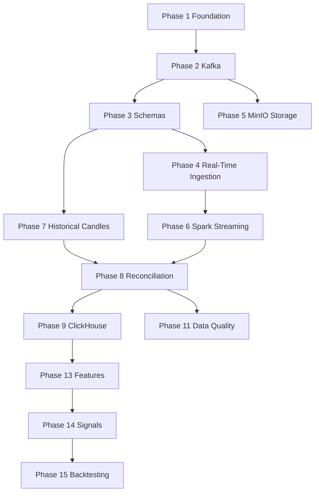

# Development Roadmap

26 phases organized into 6 milestones. Status as of August 2026.

## Milestone A — Foundation & Event Bus (Phases 1–3)

### Phase 1 — Project Foundation
**Status:** In Progress (~60%)

- [x] Git repository, `pyproject.toml`, `uv.lock`
- [x] Docker Compose (Kafka, Airflow, Postgres)
- [x] Ruff linting configuration
- [x] Pytest configuration and `tests/` directory
- [x] Repository structure (context/, docs/, infra/)
- [x] README with architecture and quick start

**Acceptance:** Cloneable repo with documented setup instructions.

---

### Phase 2 — Kafka Infrastructure
**Status:** In Progress (~70%)

- [x] Kafka broker in Docker (KRaft)
- [x] Schema Registry + Control Center
- [x] Persistent volumes for Kafka data
- [x] Topic init script (`infra/kafka/init-topics.sh`)
- [x] Standard topic definitions
- [ ] Test producer/consumer in `tests/`

**Topics:**
| Topic | Partitions | Retention |
|-------|------------|-----------|
| `market.ticks` | 3 | 7 days |
| `market.candles.raw` | 3 | 30 days |
| `market.candles.calculated` | 3 | 30 days |
| `market.candles.reconciled` | 3 | 90 days |
| `market.signals` | 1 | 30 days |
| `market.errors` | 1 | 7 days |

**Acceptance:** Topics auto-created on startup; messages can be produced and consumed.

---

### Phase 3 — Market Data Contracts
**Status:** In Progress (~80%)

- [x] JSON Schema for MarketTick, MarketCandle
- [x] JSON Schema for MarketSignal, Order, Trade, Position
- [x] Schema validation in ingestion producers
- [x] Schema validation tests

**Acceptance:** Versioned schemas in `schemas/v1/`; all producers validate before publish.

---

## Milestone B — Ingestion Layer (Phases 4, 7, 10)

### Phase 4 — Real-Time Yahoo Ingestion
**Status:** In Progress (~70%)

- [x] Yahoo WebSocket client (`ingestion/yahoo_client.py`)
- [x] Message normalization to MarketTick schema
- [x] Standalone tick service (`entrypoint/tick_service.py`)
- [x] Kafka producer with error topic routing
- [x] Configurable symbols via environment
- [x] Reconnect loop (fixed-interval; exponential backoff still pending)
- [x] Graceful shutdown on SIGTERM

**Acceptance:** Tick service runs independently; publishes validated ticks to `market.ticks`.

---

### Phase 7 — Historical Candle Ingestion
**Status:** Complete

- [x] Incremental fetch with overlap window
- [x] Publish to `market.candles.raw`
- [x] Configurable symbols
- [x] Airflow DAGs with post-close schedule (1m: every minute + 10s; 5m: every 5 min + 10s)
- [x] Airflow Variables for symbol list (`MARKET_SYMBOLS`, resolved via `dag_common.py`)

**Acceptance:** DAGs fetch only latest candles + overlap; no full re-download.

---

### Phase 10 — Airflow Orchestration
**Status:** Complete

- [x] Thin candle DAGs calling `ingestion/candles.py`
- [x] Reconciliation DAG
- [x] Data quality DAG
- [x] Tick service removed from Airflow (standalone)
- [x] Historical backfill DAG (`dag_backfill.py`, chunked range fetch)
- [x] Feature generation DAG (inside `dag_data_quality.py`)

**Acceptance:** No business logic in DAG files; all logic in importable modules.

---

## Milestone C — Storage & Streaming (Phases 5, 6, 9)

### Phase 5 — Raw Market Data Storage
**Status:** In Progress (~60%)

- [x] MinIO in Docker Compose
- [x] Parquet writer in `storage/minio_client.py`
- [x] Partition layout: `symbol/year/month/day`
- [x] Continuous tick sink from Kafka to MinIO (`tick-sink` compose service)

**Acceptance:** Raw ticks and candles persisted as Parquet in MinIO.

---

### Phase 6 — Streaming Candle Generation
**Status:** In Progress (~70%)

- [x] Spark master/worker in Docker Compose
- [x] Kafka consumption from `market.ticks`
- [x] Event-time windows with watermarks
- [x] OHLCV aggregation for 1m and 5m
- [x] Publish to `market.candles.calculated`
- [ ] Duplicate and late-event handling tests

**Acceptance:** Spark produces 1m/5m candles from tick stream.

---

### Phase 9 — ClickHouse Analytical Storage
**Status:** In Progress (~60%)

- [x] ClickHouse in Docker Compose
- [x] DDL for market_ticks, market_candles, market_features
- [x] ClickHouse client in `storage/clickhouse_client.py`
- [x] DDL for market_signals, orders, trades, positions

**Acceptance:** Candles queryable in ClickHouse; example queries documented.

---

## Milestone D — Data Quality & Reconciliation (Phases 8, 11, 12)

### Phase 8 — Candle Reconciliation
**Status:** In Progress (~70%)

- [x] Compare calculated vs raw OHLCV
- [x] Detect missing, duplicate, mismatched candles
- [x] Publish to `market.candles.reconciled`
- [x] Persist to ClickHouse and MinIO
- [ ] Data-quality metrics emission

**Acceptance:** Reconciliation job runs on schedule; discrepancies logged.

---

### Phase 11 — Data Quality
**Status:** In Progress (~60%)

- [x] Completeness checks (expected candles exist)
- [x] Uniqueness checks (no duplicate events)
- [x] OHLC validity (low ≤ open/close ≤ high)
- [x] Freshness checks (latest event age)
- [x] Consistency checks (calculated vs raw tolerance)

**Acceptance:** Data quality module runs via Airflow DAG; failures logged.

---

### Phase 12 — dbt Transformation Layer
**Status:** Not Started

- [ ] dbt project for ClickHouse
- [ ] Models: stg_market_candles, fct_market_features
- [ ] dbt tests for keys, nulls, OHLC

**Acceptance:** dbt run succeeds; tests pass.

---

## Milestone E — Analytics & Trading (Phases 13–22)

### Phase 13 — Feature Engineering
**Status:** Complete

- [x] Basic price features (returns, log return)
- [x] Momentum features (EMA 9/21, RSI — Wilder smoothed)
- [x] Volatility features (ATR, rolling std)
- [x] Volume features (relative volume, VWAP)
- [x] Market context (SPY/QQQ returns)

**Acceptance:** Features computed from reconciled candles and stored in ClickHouse.

---

### Phase 14 — Real-Time Signal Engine
**Status:** Not Started

- [ ] EMA crossover strategy
- [ ] Momentum breakout strategy
- [ ] Publish to `market.signals`

---

### Phase 15 — Backtesting Engine
**Status:** Not Started

---

### Phase 16 — Prevent Look-Ahead Bias
**Status:** Not Started

---

### Phase 17 — Risk Management Engine
**Status:** Not Started

---

### Phase 18 — Paper Trading
**Status:** Not Started

---

### Phase 19 — Portfolio Management
**Status:** Not Started

---

### Phase 20 — Broker Integration
**Status:** Not Started

---

### Phase 21 — API Layer
**Status:** Not Started

---

### Phase 22 — Dashboard
**Status:** Not Started

---

## Milestone F — Ops, ML & Cloud (Phases 23–28)

### Phase 23 — Observability
**Status:** Not Started

---

### Phase 24 — Machine Learning
**Status:** Not Started

---

### Phase 25 — CI/CD
**Status:** Not Started

---

### Phase 26 — Cloud Deployment
**Status:** Not Started

---

## Recommended Sprint Order

Sprints 1–8 (foundation through features) are complete. The path from here to paper trading +
dashboard is staged in [CURRENT_STATE.md](CURRENT_STATE.md) → "Next Steps":

1. **Stage 0** — Stabilize: tests, dependency drift, doc/port fixes *(in progress)*
2. **Stage 1** — Close data-layer gaps (Phase 13 completion, MinIO tick sink, Spark service, trading DDL)
3. **Stage 2** — Signal engine (Phase 14)
4. **Stage 3** — Backtesting + look-ahead bias prevention (Phases 15–16)
5. **Stage 4** — Risk engine, paper trading, portfolio (Phases 17–19)
6. **Stage 5** — API layer + dashboard (Phases 21–22)
7. **Stage 6** — Ops hardening

Deferred: dbt (P12), live broker (P20), ML (P24), cloud (P26).

## Dependencies

